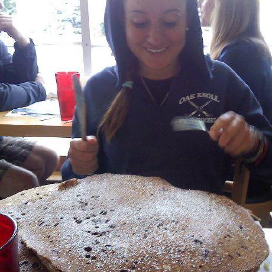
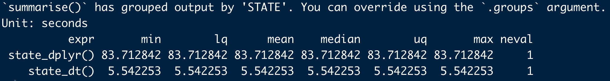
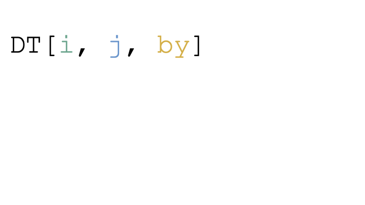
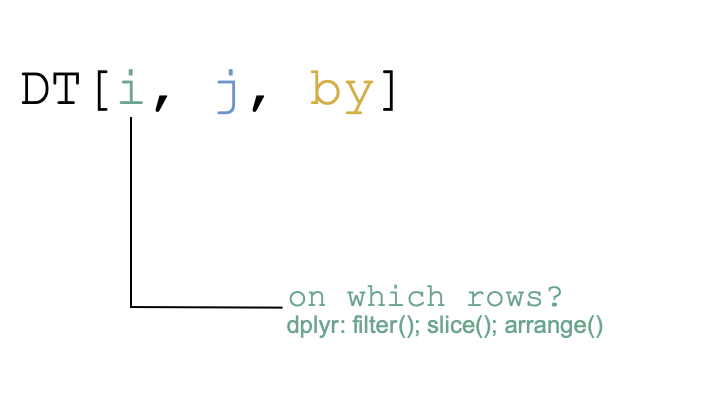
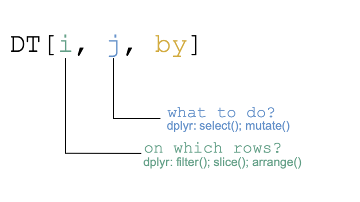
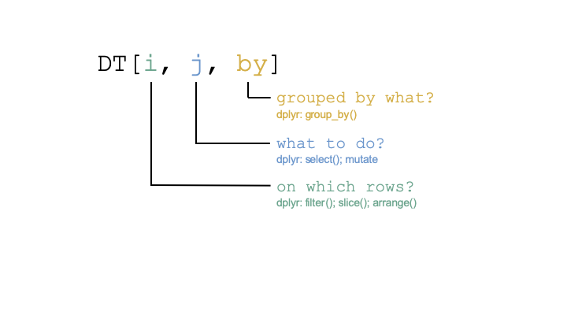

```{r, include = FALSE}
library(tidyverse)
library(data.table)
library(here)

## data files
flight_data <- 'flights14.csv'
hourly_data <- 'epa_ampd_hourly_2019_selected.csv'

## read in files
flight_tbl <- read_csv(here::here("data", flight_data))

flight_dt <- fread(here::here("data", flight_data))

```


class: inverse, center, middle
name: background

# Who we are

<hr/>

---

# Hello!

.pull-left[
.center[
```{r echo = FALSE, out.width = '60%'}

```
]

.center[**Meas Meng**]
* Postdoc at emLab and CETlab (UCSB)
* Research interests: water-energy-climate nexus, electricity modeling, stationery

]


.pull-right[
.center[
```{r echo = FALSE, out.width = '60%'}

```
]

.center[**Tracey Mangin**]
* Researcher at emLab (UCSB)
* Research interests: natural resource management, environmental justice, Bravo

]


---

# Motivation

.pull-left[
.center[**What I was expecting**]
]

---

# Motivation

.pull-left[
.center[**What I was expecting**]

.center[
```{r echo = FALSE, out.width = '60%'}
knitr::include_graphics("img/stop.png")
```
]

.center[~7 minutes to check email]
]


---

# Motivation

.pull-left[
.center[**What I was expecting**]

.center[
```{r echo = FALSE, out.width = '60%'}
knitr::include_graphics("img/stop.png")
```
]

.center[~7 minutes to check email]
]

.pull-right[
.center[**What happened...**]
]

---

# Motivation

.pull-left[
.center[**What I was expecting**]

.center[
```{r echo = FALSE, out.width = '60%'}
knitr::include_graphics("img/stop.png")
```
]

.center[~7 minutes to check email]
]

.pull-right[
.center[**What happened...**]


.center[
```{r echo = FALSE, out.width = '62%'}
knitr::include_graphics("img/mindblown.png")
```
]

.center[the data... immediately!]

]

---

# Resources

we used the following resources to build this preso:

- [Data cleaning & wrangling: (2) data.table, Grant McDermott](http://rmarkdown.rstudio.com>)
      * detailed information and examples

- [Introduction to data.table](https://rdatatable.gitlab.io/data.table/articles/datatable-intro.html#what-is-datatable-1a)
      * a great introduction

- [A data.table and dplyr tour](https://atrebas.github.io/post/2019-03-03-datatable-dplyr/#summarise-data)
      * a great resource for examining data.table and dplyr "equivalents"

- [data.table intro and cheat sheet](https://rdatatable.gitlab.io/data.table/)
      * quick overview and cheat sheet! who doesn't love a cheat sheet?

---

# Overview
  
--

## setup
* install packages:
      * `data.table`
      * `tidyverse`
      * `here`
      * `janitor`
      * `microbenchmark`

* move data to *data* folder in repo (included in `.gitignore`):
      * flights14.csv
      * epa_ampd_hourly_2019_selected.csv
      * facility_01-27-2021_224024745.csv
      
---

# Overview
  

## presentation
1. intro to `data.table`
2. create a `data.table`
3. basic syntax
4. examples of data manipulation (`dplyr` and `data.table` comparisons)
      * filter
          * helpers
      * create new columns
      * grouping
      * helper operators
      * chain
      * merging
      * keys
5. random cool things
6. random not cool things

---

# Overview

## follow-along.R
includes code from this presentation plus more.

## live coding
interactive-notebook.Rmd

---


class: inverse, center, middle
name: background

# Intro to data.table

<hr/>

---

# What is data.table?

`data.table` provides an enhanced, high-performance version of base R’s `data.frame` with syntax and feature enhancements for ease of use, convenience and programming speed.

--

## why use data.table?
--

* memory efficient


---

# What is data.table?

`data.table` provides an enhanced, high-performance version of base R’s `data.frame` with syntax and feature enhancements for ease of use, convenience and programming speed.


## why use data.table?

* memory efficient

    * Trust Grant! (we'll touch on *modifying in place*, or *modifying by reference*)

---


# What is data.table?

`data.table` provides an enhanced, high-performance version of base R’s `data.frame` with syntax and feature enhancements for ease of use, convenience and programming speed.


## why use data.table?

* memory efficient

* fast speed
---

# What is data.table?

`data.table` provides an enhanced, high-performance version of base R’s `data.frame` with syntax and feature enhancements for ease of use, convenience and programming speed.


## why use data.table?

* memory efficient

* fast speed
```{r eval = FALSE}
state_dplyr <- function() {
  hourly_tbl <- read_csv(here::here("data", hourly_data))
  hourly_tbl %>%
    group_by(STATE, FACILITY_NAME) %>%
    summarise(mean_so2_rate = mean(`SO2_RATE (lbs/mmBtu)`, na.rm = T),
              mean_nox_rate = mean(`NOX_RATE (lbs/mmBtu)`, na.rm = T)) %>%
    ungroup()
  }
state_dt <- function() {
  hourly_dt <- fread(here::here("data", hourly_data))
  hourly_dt[, .(mean_so2_rate = mean(`SO2_RATE (lbs/mmBtu)`, na.rm = T),
                mean_nox_rate = mean(`NOX_RATE (lbs/mmBtu)`, na.rm = T)),
            by = .(STATE, FACILITY_NAME)]
  }
```

---

# What is data.table?

`data.table` provides an enhanced, high-performance version of base R’s `data.frame` with syntax and feature enhancements for ease of use, convenience and programming speed.


## why use data.table?

* memory efficient

* fast speed
```{r eval = FALSE}
microbenchmark::microbenchmark(state_dplyr(), state_dt(), times = 1)
```

.center[
```{r echo = FALSE, out.width = '80%'}

```
]


---

# What is data.table?

`data.table` provides an enhanced, high-performance version of base R’s `data.frame` with syntax and feature enhancements for ease of use, convenience and programming speed.


## why use data.table?

* memory efficient

* fast speed

* concise and consistent syntax: fast to type, fast to read

---

# What is data.table?

`data.table` provides an enhanced, high-performance version of base R’s `data.frame` with syntax and feature enhancements for ease of use, convenience and programming speed.


## why use data.table?

* memory efficient

* fast speed

* concise and consistent syntax: fast to type, fast to read

```{r message = FALSE, results = "hide"}

## flight tibble, dplyr:
flight_tbl %>%
  filter(origin == "EWR") %>%
  group_by(carrier, dest) %>%
  summarise(mean_dep_delay = mean(dep_delay),
            mean_arr_delay = mean(arr_delay))

## flight dt, data.table:
flight_dt[origin == "EWR", .(mean_dep_delay = mean(dep_delay), mean_arr_delay = mean(arr_delay)),
          by = .(carrier, dest)]

```

---

# What is data.table?

`data.table` provides an enhanced, high-performance version of base R’s `data.frame` with syntax and feature enhancements for ease of use, convenience and programming speed.


## why use data.table?

* memory efficient

* fast speed

* concise and consistent syntax: fast to type, fast to read

## dplyr or data.table?

--

* use them both!

* each has advantages

---
class: inverse, center, middle
name: background

# Create a data.table

<hr/>

---

# Create a data.table

--

## read in file with `fread()`

```{r eval = FALSE}

## read_csv(), dplyr:
flight_tbl <- read_csv(here::here("data", flight_data))

## fread(), data.table:
flight_dt <- fread(here::here("data", flight_data))
```

---

# Create a data.table

## read in file with `fread()`

## create from scratch with `data.table()`

```{r eval = FALSE}

## creates a tibble:
example_tbl <- tibble(x = 1:10, y = letters[1:10])

## creates a data.table
example_dt <- data.table(x = 1:10, y = letters[1:10])
```

---

# Create a data.table

## read in file with `fread()`

## create from scratch with `data.table()`

## coerce an existing data frame with `as.data.table()`

```{r}
## create data frame
temp1 <- data.frame(x = 1:10, y = 10:1)

## coerce to a tibble
temp1_tbl <- as_tibble(temp1)

## coerce to a data.table
temp1_dt <- as.data.table(temp1)
```

---

# Create a data.table

## read in file with `fread()`

## create from scratch with `data.table()`

## coerce an existing data frame with `as.data.frame()`

## coerce an existing data frame *by reference* with `setDT()`

```{r}
## create data frame
temp2 <- data.frame(x = 1:10, y = letters[1:10])

## modify in place
setDT(temp2)
str(temp2) ## check class

```

---

# Create a data.table

## read in file with `fread()`

## create from scratch with `data.table()`

## coerce an existing data frame with `as.data.frame()`

## coerce an existing data frame *by reference* with `setDT()`

* avoids creating a copy of data and instead changes it where it exists in memory

* memory efficient and fast!

* more to come when we talk about data manipulation...

---

class: inverse, center, middle
name: background

# Basic syntax

<hr/>

---

# Basic syntax

.center[
```{r echo = FALSE, out.width = '80%'}

```
]

---

# Basic syntax

.center[
```{r echo = FALSE, out.width = '80%'}

```
]

---

# Basic syntax

.center[
```{r echo = FALSE, out.width = '80%'}

```
]

---

# Basic syntax

.center[
```{r echo = FALSE, out.width = '80%'}

```
]

---

class: inverse, center, middle
name: background

# Data manipulation

<hr/>

---

# Data manipulation

## filtering
filter in `i`...

--

```{r results = "hide"}
  
## filter origin for EWR

## dplyr
flight_tbl %>%
  filter(origin == "EWR")
  
## data.table
flight_dt[origin == "EWR"]

```


---

# Data manipulation

## filtering
filter in `i`...

## helpers

---

# Data manipulation

## filtering
filter in `i`...

## helpers

  * filter for pattern with `%like%`

```{r}

# filter dest for pattern "HO"
  like_dt <- flight_dt[dest %like% "HO"]
  unique(like_dt[, dest])

```

---

# Data manipulation

## filtering
filter in `i`...

## helpers

* filter for pattern with `%like%`

* filter between numbers using `%between%`
```{r}
# filter air time between 0 and 180 minutes
  between_dt <- flight_dt[dep_delay %between% c(0, 180)]
  
  min(between_dt[, dep_delay])
  max(between_dt[, dep_delay])

```

---

# Data manipulation

## filtering
filter in `i`...

## helpers

* filter for pattern with `%like%`

* filter between numbers using `%between%`

* filter using `%chin%` (similar to `%in%`, but faster!)
```{r}
# filter dest for LAX, SEA, and PHX using %chin%
  chin_dt <- flight_dt[dest %chin% c("LAX", "SEA", "PHX")]
  unique(chin_dt[, dest])

```

---

# Data manipulation

## working with columns in `j`

--

* `j` takes a list using `list()` or `.()`

* select columns
```{r eval = FALSE}
## select columns month, day, and carrier
## dplyr
flight_tbl %>%
  select(month, day, carrier)
  
## data.table (the following three do the same thing)
# flight_dt[, list(month, day, carrier)]
# flight_dt[, c("month", "day", "carrier")]
flight_dt[, .(month, day, carrier)]
  
```

---

# Data manipulation

## working with columns in `j`

* `j` takes a list using `list()` or `.()`

* select columns

* drop columns
```{r eval = FALSE}
## drop columns month, day, and carrier
## dplyr (these two do the same)
flight_tbl %>%
  select(-month, -day, -carrier)

flight_tbl %>%
  select(!c(month, day, carrier))
  
## data.table
flight_dt[, !c("month", "day", "carrier")]

```

---

# Data manipulation

## working with columns in `j`

* `j` takes a list using `list()` or `.()`

* select columns

* drop columns

* rename columns
```{r eval = FALSE}
## rename dest to destination
## dplyr
flight_tbl %>%
  rename(destination = dest)

## data.table -- this will modify in place
setnames(flight_dt, "dest", "destination")

```

---

# Data manipulation

## working with columns in `j`

* `j` takes a list using `list()` or `.()`

* select columns

* drop columns

* rename columns

* update/create new columns with `:=`
      * "walrus"
      * modifies in place (i.e. by reference)
---

# Data manipulation

## working with columns in `j`

* update/create new columns with `:=`
      * "walrus"
      * modifies in place (i.e. by reference)
      
```{r eval = FALSE}
## create new column called month_day 
## dplyr
flight_tbl %>%
  mutate(month_day = paste(month, day, sep = "-"))
```
```{r eval = TRUE}
## data.table -- this will modify in place
flight_dt[, month_day := paste(month, day, sep = "-")]
flight_dt[1:2]

```

---

# Data manipulation

## working with columns in `j`

* update/create new columns with `:=`
      * "walrus"
      * modifies in place (i.e. by reference)
      
## LHS := RHS form

```{r}
## calculate the mean dep_delay and mean arr_delay for carrier, origin, and dest
## data.table -- this will modify in place
flight_dt[, c("mean_dep_delay", "mean_arr_delay") := .(mean(dep_delay), mean(arr_delay))]

flight_dt[1:2]
```

---

# Data manipulation

## working with columns in `j`

* update/create new columns with `:=`
      * "walrus"
      * modifies in place (i.e. by reference)
      
## LHS := RHS form

## functional form

```{r}
## drop mean_dep_delay and mean_arr_delay
## data.table -- this will modify in place
flight_dt[, `:=`(mean_dep_delay = NULL,
                 mean_arr_delay = NULL)][1:2]
```

---

# Data manipulation

## working with columns in `j`

* update/create new columns with `:=`

* drop column with `:= NULL`
```{r eval = TRUE}
## drop month_day
## data.table -- this will modify in place
flight_dt[, month_day := NULL]

flight_dt[1:3]
```

---

# Data manipulation

## grouping with `by`

* by takes a list using `list()` or `.()`

* group by and summarise (does *not* modify in place)
--

```{r eval = F}
## calculate the mean dep_delay for carrier, origin, and dest
## dplyr
flight_tbl %>%
  group_by(carrier, origin, dest) %>%
  summarise(mean_dep_delay = mean(dep_delay)) %>%
  ungroup()
```

```{r}
## data.table -- this DOES NOT modify in place
## print first 3 rows
flight_dt[, .(mean_dep_delay = mean(dep_delay)), by = .(carrier, origin, dest)][1:3]

```

---

# Data manipulation

## grouping with `by`

* by takes a list using `list()` or `.()`

* group by and summarise (does *not* modify in place)

* group by and create a new column using `:=` (modifies in place)
--

```{r eval = F}
## calculate the mean dep_delay for carrier, origin, and dest
## dplyr
flight_tbl %>%
  group_by(carrier, origin, dest) %>%
  mutate(mean_dep_delay = mean(dep_delay)) %>%
  ungroup()
```
```{r}
## data.table -- this will modify in place
flight_dt[, mean_dep_delay := mean(dep_delay), by = .(carrier, origin, dest)]
flight_dt[1:2]
```

---

# Data manipulation

## helpful operators

* calculate the number of rows with `.N`
```{r eval = F}
## how many entries for each carrier?
## dplyr
flight_tbl %>%
  group_by(carrier) %>%
  summarise(n = n()) %>%
  ungroup()
```
```{r}
## data.table -- this will not modify in place
flight_dt[, .N, by = carrier][1]
## compare with 
flight_dt[, n := .N, by = carrier][1]
```


---


# Data manipulation

## helpful operators

* calculate the number of rows with `.N`

* return count of unique values with `uniqueN`

* calculate on a subset of data with `.SD`

```{r}
## how many unique origin and dest locations by carrier?

## data.table -- this will not modify in place
flight_dt[, lapply(.SD, uniqueN), by = carrier, .SDcols = c("origin", "dest")][1:3]


```

---

# Data manipulation

## notes on modifying by reference

--
* important implications for data manipulation

--

* modifying a copy can modify the original
```{r }
## make copy of temp2
temp2_copy <- temp2
temp2_copy[, y := NULL]

head(temp2_copy)
```

---

# Data manipulation

## notes on modifying by reference

* important implications for data manipulation

* modifying a copy can modify the original
```{r eval = F}
## make copy of temp2
temp2_copy <- temp2
temp2_copy[, y := NULL]

head(temp2_copy)
```

  * what about `temp2`?

---
  
# Data manipulation

## notes on modifying by reference

* important implications for data manipulation

* modifying a copy can modify the original
```{r eval = F}
## make copy of temp2
temp2_copy <- temp2
temp2_copy[, y := NULL]

head(temp2_copy)
```

  * what about `temp2`?
```{r}
head(temp2)
```

---

# Data manipulation

## notes on modifying by reference

* important implications for data manipulation

* modifying a copy can modify the original
```{r eval = F}
## make copy of temp2
temp2_copy <- temp2
temp2_copy[, y := NULL]

head(temp2_copy)
```

  * what about `temp2`?

  * use `data.table::copy()` to create a copy to manipulate without modifying original

---

# Data manipulation

## chain

* similar to `%>%` in dplyr

* `[]`

--

```{r eval = FALSE}
## chain operations
## dplyr
    flight_dt %>%
      mutate(delay_diff = dep_delay - arr_delay,
             diff_over_at = delay_diff / air_time)

## data.table -- this will not modify in place
flight_dt[, delay_diff := dep_delay - arr_delay][, diff_over_at := delay_diff / air_time]

```

---

# Data manipulation

## joins

* use `merge()`

* full join: `all = TRUE`

* left join: `all.x = TRUE`

* right join: `all.y = TRUE`

---

# Data manipulation

## set keys
keys are like row names. setting keys...

* reorders the rows of a data.table by the key columns in increasing order

* makes lookups in key columns faster

* allows for merging without specifying merging columns

--
```{r}
## set keys on origin and dest
setkey(flight_dt, origin, dest)

key(flight_dt)

## subset on first key (origin), and then on second key (destination)
flight_dt[.("JFK", "MIA")][2]

```

---

# extra cool things

## running shell commands in ``fread()``

Let's say there's a zip file that has one CSV file inside. We can bypass the steps of downloading and unzipping it by using shell commands like ``curl`` and ``funzip`` directly in ``fread()``:

``fread("curl ftp://newftp.epa.gov/DMDnLoad/emissions/hourly/monthly/2019/2019ca01.zip | funzip")``

---

# random not-so-cool things

## no equivalent to `cross()` / `expand_grid`?
  
```{r }
df1 <- data.table(a = c(1986, 1990, 2014))
df2 <- data.table(b = c(1, 1, 2))

expand_grid(df1, df2)

```

---
  
# random not so cool things

* no equivalent to `cross()` / `expand_grid`?
  
```{r }
df1 <- data.table(a = c(1986, 1990, 2014))
df2 <- data.table(b = c(1, 1, 2))

# expand_grid(df1, df2)
crossing(df1, df2)

```

---
  
# live coding!

## time to move to the interactive folder
  
  
  